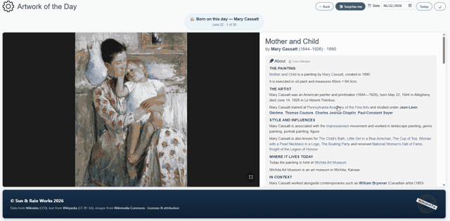
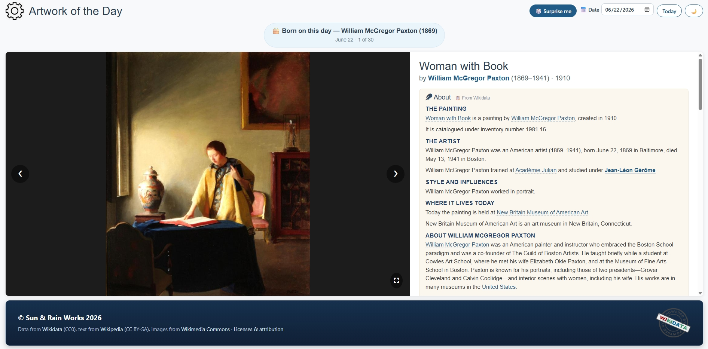
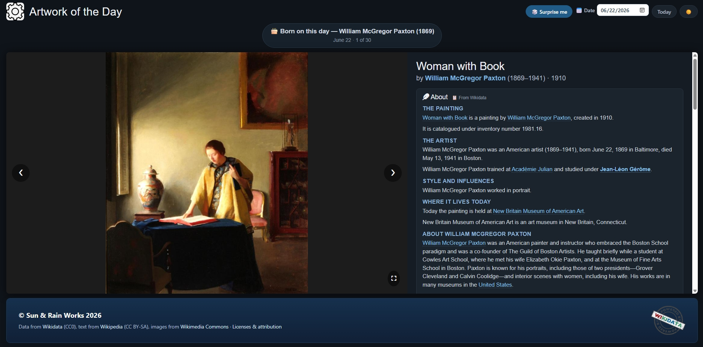
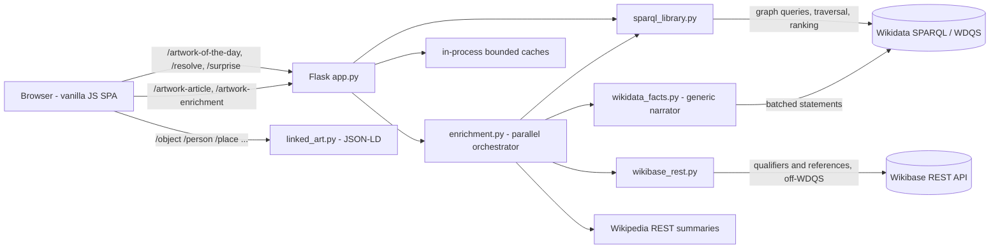

# Artwork of the Day

[](https://github.com/sundog358/artwork-of-the-day/actions/workflows/ci.yml)
[](https://metahistorybook.com)
[](LICENSE)
[](https://metahistorybook.com/legal)

A daily art-history explorer. Every day it shows a painting by an artist **born
on today's date**, then builds a rich, **deterministic, fully-cited article**
about it — and the people, places, movements and institutions around it — live
from open knowledge graphs. **No LLM, no API keys, no per-token cost.** Every
sentence is a real Wikidata fact or attributed Wikipedia text.

**▶ Live: [metahistorybook.com](https://metahistorybook.com)**



> Click any underlined name (*Mary Cassatt*, here, from Paxton's "Lineage and
> peers") and the app jumps to one of *their* paintings — a knowledge-graph
> rabbit hole, all from open data.

| Light | Gallery (dark) mode |
| --- | --- |
|  |  |

📍 **Roadmap:** [ROADMAP.md](ROADMAP.md) — what's shipped, what's next, and the deliberate non-goals.

---

## Case study — the 30-second version

**The idea.** Wikidata holds millions of artworks, artists, places and movements
as a structured graph — but it isn't something you'd *read*. The goal was to turn
that graph into a polished, trustworthy daily art-history experience, and to do it
*without* a language model, so nothing can be invented.

**The key decision — grounded over generated.** Every sentence is assembled
deterministically from a real Wikidata statement or attributed Wikipedia text (an
earlier optional LLM layer was removed entirely). That single constraint forced
the interesting engineering: a schema-agnostic narrator, multi-hop
notability-ranked graph traversal, and a measured two-API hybrid — SPARQL for
graph shape, the Wikibase REST API for qualifiers and references. The same facts
are then *republished* as schema-valid **Linked Art** (CIDOC-CRM JSON-LD, 7
dereferenceable record types, authority links to VIAF/Getty/ISNI) and **IIIF**
manifests, so the output is interoperable open data rather than a silo.

**The outcome.** A live, deployed product
([metahistorybook.com](https://metahistorybook.com)) that doubles as a reusable
narration engine — green CI (ruff · mypy across the codebase · 69 tests),
accessibility, SEO, Docker, an IIIF deep-zoom viewer, and records validated
against the official Linked Art JSON Schemas. The thesis in one line: **cited,
deterministic and standards-compliant beats generated.**

## Reviewer quick scan

If you're evaluating this as a portfolio project, the strongest signals are:

- **Trustworthy by construction** — no LLM layer; prose is assembled from
  Wikidata statements and attributed Wikipedia summaries.
- **Real product surface** — live deployment, shareable artwork URLs, social
  preview cards, deep zoom, keyboard navigation, accessibility states, and
  user-facing attribution.
- **Interoperable data engineering** — the same artwork is also served as IIIF
  Presentation 3.0 and Linked Art / CIDOC-CRM JSON-LD.
- **Reviewable quality bar** — deterministic mocked tests, route coverage,
  parser coverage, lint, format, and type checks all run in CI.

## Why it's interesting

This isn't a CRUD app — it's a small **knowledge-graph narration engine**. The
hard parts:

- A **schema-agnostic narrator** that turns *any* Wikidata entity's statements
  into prose from a property→template registry (add a fact type = one line).
- **Multi-hop graph traversal**, notability-ranked — *"In Gérôme's circle of
  pupils, Paxton trained alongside Mary Cassatt, Thomas Eakins…"* — every name
  clickable to fall down the rabbit hole.
- A deliberate **two-API hybrid**: SPARQL for everything graph-shaped (search,
  traversal, ranking), and the **Wikibase REST API** for the entity-by-id reads
  where it genuinely wins (qualifier spans, references) — taking load off the
  rate-limited SPARQL endpoint.
- **Parallelized I/O** — ~16 independent SPARQL/REST/Wikipedia calls run
  concurrently, so a deeply-enriched article assembles in ~2–3s.

## Features

- **Tied to the date** — painters born on today's month/day; stable per day.
- **Deep, deterministic articles** — the work's facts, a closer look at the
  depicted subjects, the artist's life, genre & tradition, academic lineage &
  peers, where the work is held, dated history (*"stolen 1911, recovered 1913"*),
  the work's place in the artist's life, related works, and data provenance.
- **Explore** — click any related work / artist / movement to load it; a date
  picker for any day; "🎲 Surprise me"; a Back stack.
- **Gallery (dark) mode** — paintings on a museum wall, persisted across visits.
- **Social link previews** — every painting has a share URL (`/a/<QID>`) with
  **server-rendered Open Graph tags** and a branded **1200×630 card** generated on
  the fly (`/og/<QID>.jpg`), so a shared link previews the actual artwork on
  Facebook, LinkedIn, Slack, iMessage and X — not a generic logo.
- **Deep-zoom viewer** — click the painting for a full-resolution
  [IIIF](https://iiif.io) + OpenSeadragon lightbox; every artwork also serves a
  IIIF Presentation 3.0 manifest at `/iiif/<QID>/manifest.json`.
- **Linked Art API** — every entity is a dereferenceable
  [Linked Art](https://linked.art) / CIDOC-CRM JSON-LD record (object, person,
  place, group, concept, set at `/object/<QID>` etc.) with authority links
  (VIAF/Getty/ISNI), provenance events, content negotiation, HAL and CORS —
  validated against the official JSON Schemas.
- **Production-ready** — rate limiting, bounded caches, reverse-proxy awareness,
  a health check, and live, per-item attribution.

## Architecture



The base article is instant; the **progressive enrichment** streams in below it
(and is cached per artwork), so first paint never waits on the deep layers.

## Key technical decisions

These are the trade-offs I'd talk through in a review:

- **Deterministic over generative.** The app once had an optional LLM layer; I
  removed it. Every line is now a real fact or attributed quote, the "📋 From
  Wikidata" badge is literally true, and there are no keys/cost. Trust over
  fluency.
- **Right API for each job (measured, not assumed).** I prototyped moving the
  label-heavy entity reads to the Wikibase REST API and **measured 40 value-label
  lookups per entity** (REST has no batch-label endpoint) vs **1** SPARQL query
  with labels inline — so I kept those on SPARQL and used REST only for qualifier
  spans and references, where it's actually better. The reasoning is in the git
  history.
- **Knowing when to stop.** A "paintings from year *N*" query was un-indexable on
  WDQS (~23s scanning 390k rows); I dropped it and used same-collection /
  same-movement instead. Silent truncation and slow features are worse than fewer.
- **Parallelism with politeness.** Enrichment fans out across a thread pool capped
  at 5 workers (WDQS's per-IP concurrency), cutting wall-time ~3× with graceful
  degradation — a throttled query drops one section, never the page.

See **[WIKIDATA.md](WIKIDATA.md)** for the query/data-model deep-dive.

## Tech stack

Python · Flask · Waitress · Flask-Limiter · SPARQL (WDQS) · Wikibase REST API ·
Wikimedia REST · Linked Art (CIDOC-CRM JSON-LD) · vanilla JS (no build step) ·
Docker · Render · GitHub Actions · pytest.

## Run locally

Requires Python 3.10+.

```bash
python -m venv .venv
.venv/Scripts/activate            # Windows  (source .venv/bin/activate on *nix)
pip install -r requirements.txt -r requirements-dev.txt

python serve.py                   # production WSGI (Waitress) → http://127.0.0.1:5000
# FLASK_DEBUG=1 python app.py     # dev server with auto-reload
```

It needs **no secrets**. Optional env vars (`AOTD_CONTACT`, rate limits, cache
size) are in [.env.example](.env.example).

## Quality

```bash
pytest -q          # 69 deterministic tests (HTTP mocked where needed)
ruff check .       # lint
ruff format .      # format
mypy               # type-check the typed core modules
python validate_linked_art.py  # live Linked Art schema validation
```

A fast, no-network suite covers the deterministic core (the property narrator,
qualifier/date parsing, article assembly), the **network-facing parsers**
(Wikibase REST + SPARQL bindings, with HTTP mocked), and route-level behavior
through Flask's test client. CI runs **lint, format-check, type-check, and tests**
on every push. The frontend adds **accessibility** (descriptive alt text, visible
focus, ARIA state) and **SEO** (per-artwork Open Graph / Twitter tags + a
`schema.org/VisualArtwork` block, so a shared link previews the actual painting).
For release checks, `validate_linked_art.py` builds live sample records and
validates all seven Linked Art record types against the vendored official JSON
Schemas.

## Deploy

Standard WSGI app, no secrets. A [`render.yaml`](render.yaml) blueprint and a
slim [`Dockerfile.web`](Dockerfile.web) are included — see
[DEPLOY.md](DEPLOY.md) for one-click Render / Cloud Run / Railway.

## Project structure

| File | Role |
| --- | --- |
| `app.py` | Flask routes, caching, rate limiting, ProxyFix, health check |
| `sparql_library.py` | SPARQL: dossier, traversal, notability ranking, aggregation |
| `wikidata_facts.py` | Generic schema-agnostic statement → sentence narrator |
| `wikibase_rest.py` | Wikibase REST client: qualifier spans + references (off-WDQS) |
| `enrichment.py` | Parallel orchestrator that assembles the progressive article |
| `article_writer.py` | The instant base "About" article from the dossier |
| `linked_art.py` | Linked Art / CIDOC-CRM JSON-LD records |
| `static/index.html` | Single-page frontend (vanilla JS) |
| `tests/` | pytest unit suite |

## Licensing & attribution

- **Code** — MIT ([LICENSE](LICENSE)).
- **Facts** — [Wikidata](https://www.wikidata.org), CC0 1.0.
- **Article text** — [Wikipedia](https://en.wikipedia.org), CC BY-SA 4.0,
  attributed inline.
- **Images** — [Wikimedia Commons](https://commons.wikimedia.org), per-file
  licenses; each image links to its Commons file page.

Full, user-facing breakdown at **[`/legal`](https://metahistorybook.com/legal)**.
Attribution is maintained **live** — each item links back to its sources.
